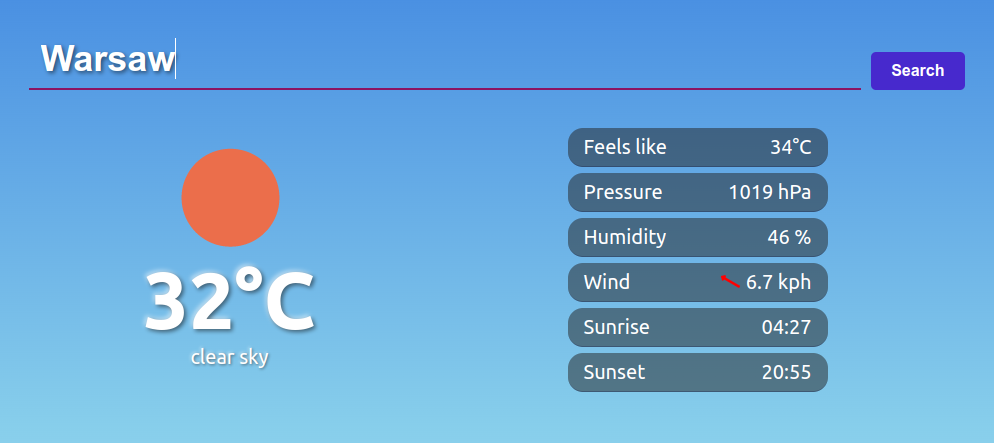
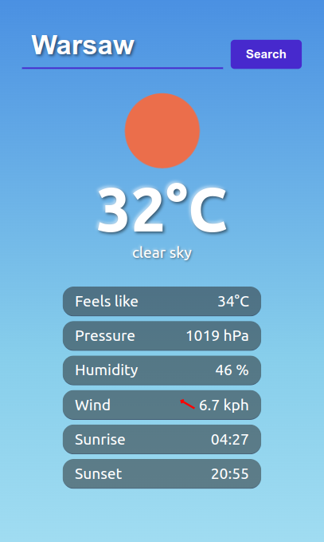
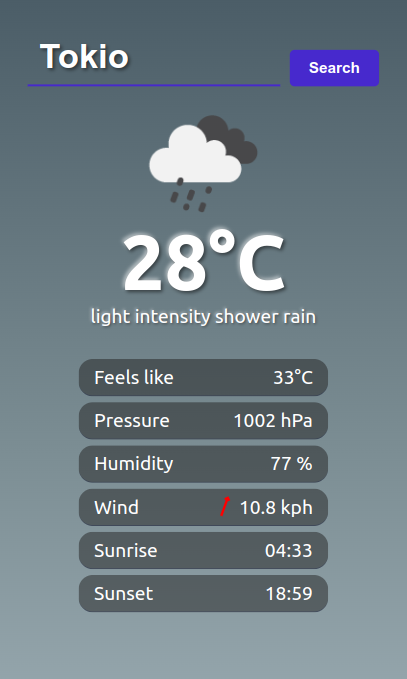

# vueather

Vue.js weather app.

A sleek and responsive weather application built with Vue 3 and the OpenWeather API.

## Features

- City search functionality
- Current weather display (temperature, pressure, humidity, wind)
- Rotating wind arrow
- Dynamic background based on weather conditions
- Sunrise and sunset times
- Responsive design

## Setup Information

### Install packages

```sh
npm install
```

### Configure ENV variables
create `.env` with Open Weather API KEY (see .env.example)
```
API_KEY=1234567890987654321
```

### Development

```sh
npm run dev
```

### Run Unit Tests

```sh
npm run test:unit
```

## Screenshots



